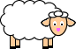
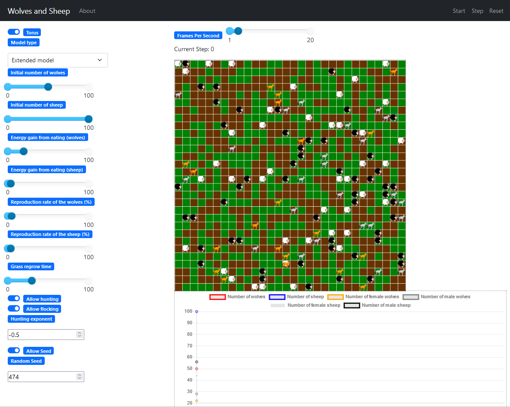

<h1>English Wolves and Sheep population model  </h1>

<h2>Introduction</h2>

The "Wolves and Sheep" is a self-programmed mesa implementation and further development of an agent-based model created in NetLogo.
This model models the cohabitation of a predator species and one of its prey in three ways.
The default model type contains my extensions while the rest two are meant to implement the original model's two types as faithfully as possible.

<h2>The model types' operational characteristics</h2>

<h3>Mutual characteristics</h3>

In all three models, there are two animal species, one predator and one of its prey, which are represented by wolves and sheep.
These animals live in a grassy area where the sheep graze the grass, the wolves eat the sheep.
Furthermore, all entities have some energy (energy point from now on) which is decreased by one in every step (the model's change of state) but is increased by the given parameter by eating. If there energy is fully consumed (not 0 but less than 0 energy point) they die. They can also reproduce randomly, however doing so halves their energy.

In the original model, the grass were put in the cells as patches while in this implementation as agents. In the case of all three models, the number of grass agents is the same as the number of cells. The grass has two states, grown and grazed.

New parameters which work for all three models:

<ul>
<li>Whether the wolves should hunt actively.</li>
<li>Hunting limiter exponent. See below.</li>
<li>Whether the sheep try to flock.</li>
<li>The seed that controls the random functions. The seed makes the runs reproducable, but can be turned off.</li>
</ul>

The hunt limiter exponent means that the probability of a wolf hunts actively is $(\text{energy point})^{-|\text{exponent}|}$.
So, if the exponent is 0 there's no limitation. It's imortant to note the reason behind the exponent being nonpositive is that the probability would be 100% just like in case of 0 due to how the code works. Overhunt is typical in case of free hunt this was the motivation behind the exponent.

<h3>Wolves and sheep</h3>

<ul>
<li>The simplest model type, which was directly implemented from the original model.</li>
<li>All the grasses are always grown.</li>
<li>The sheep have infinite energy (it doesn't change).</li>
<li>The wolves eat one sheep from the cell they're residing with given probability.</li>
<li>The entities give birth to one descendant with given probability which descendant is put into one of the neighboring cells.</li>
</ul>

<h3>Wolves, sheep and grass</h3>

<ul>
<li>Also implemented from the original model.</li>
<li>The rules above are still intact alongside the ones below.</li>
<li>The sheep's energy changes just like the wolves'.</li>
<li>The grazed grass agents become grown again after given number of steps.</li>
</ul>

<h3>Extended model</h3>

<ul>
<li>The model type extended by me.</li>
<li>The animal agents have gender.</li>
<li>For reproduction, two entities with different genders must be present in the same cell and both parents must "want" it.</li>
<li>Because of the new reproduction conditions, one parent's reproduction probability is the square root of the parameter, so the parents give the parameter together.</li>
</ul>

<h2>The visualization application</h2>

<h3>Running</h3>

The model's visualization is done by the mesa_viz_tornado python package (so Python is a dependency) which is automatically installed during mesa version 2.4.0's installation but the newer versions (3.0.0+) don't use it anymore so for the sake of compatibility the neccessary elements are imported directly. 

The visualization application can be run in multiple ways. One way is to run run.py which is can be found alongside this file, or we type "mesa runserver" without quotation marks into a terminal opened in this folder.

Unfortunatley, running is only recommended under Linux, because for some reason under Windows the interactive elements don't appear correctly on the webpage generated by mesa_viz_tornado, but despite this everything works fine. However, via WSL or virtual machine it can be perfectly run on Windows as well. Both methods were tested under Debian Linux. I recommend the WSL method, because the shown IP-address URL works (http://127.0.0.1:8521, which is equivalent with <a href=http://localhost:8521>localhost:8521</a>) unlike with a virtual machine, where the IP-address depends on the program and its settings, or we use the application inside the virtual machine.

<h3>Handling</h3>

 

The figure above is a screenshot of the app in initial state with deafult parameters.

The default language of the webpage is English but by clicking on the flag in the top right corner it can be changed to Hungarian and back. The model's name can be seen in the top left corner, next to it by clicking on the About button README.md's shortened and current language version can be read. The Start, Step and Reset buttons are left to the flag which do what's on the tin but the Start button becomes the Stop button if the simulation is running.

The model's parameters can be set on the left side, the grid that visualizes the model is in the middle, above it the simulation's speed can be set whose default value is 3 steps/second, however the number of agents can effect it (for example in case of overgrowth it's slower). Under the grid the graphs can be seen (the bottom one couldn't fit in the picture), among them the 1st one is the number of entities by species and gender depending on the number of steps. The bottom graph is the percentage of the grown grass agents also depending on the number of steps.

The female wolves are orange, the male ones are gray, the female sheep are white, the male ones are black. The consequence of this choice is that in the inherited models all wolves are male and all sheep are female.

<h1>Magyar Farkasok és bárányok populációmodell  </h1>

<h2>Előszó</h2>

A "Farkasok és bárányok" egy NetLogoban készült ágens alapú modell saját programozású mesa implementációja, illetve továbbfejlesztése.
Ez a modell egy ragadozófaj és annak egy prédájának populációinak együttélését modellezi háromféleképpen.
Az alapértelmezett modelltípus a saját bővítéseimet tartalmazza, míg a másik kettő az eredeti modell két típusát hivatott a lehető leghűbben implementálni.

<h2>A modelltípusok működési jellemzői</h2>

<h3>Közös jellemzők</h3>

Mindhárom modellben van két állatfaj, egy ragadozó és annak egy prédája, amelyeket farkasokkal és bárányokkal reprezentálunk.
Ezek az állatok egy füves területen élnek, ahol a bárányok legelik a füvet, a farkasok megeszik a bárányokat.
Továbbá minden egyednek van valamennyi energiája (továbbiakban energiapont), amely minden lépésben (a modell állapotváltozása) eggyel csökken, de evés által a megadott paraméternyivel megnő. Ha elfogy az energiájuk (nem 0, hanem kevesebb, mint 0 energiapont), akkor meghalnak. Ezek mellett képesek is szaporodni valószínűségi alapon, azonban ekkor az energiájuk megfeleződik.

Az eredeti modellben a fű mint "patchek" voltak a cellákba helyezve, míg ebben az implementációban ágensként. Mindhárom modell esetén annyi fű ágens van ahány cella. A fűnek két állapota van, a kinőtt és a lelegelt.

Új paraméterek, amely mindhárom modellnél működnek:

<ul>
<li>A farkasok aktívan vadásszanak-e.</li>
<li>A vadászatot korlátozó kitevő. Lásd lejjebb.</li>
<li>A bárányok nyájba igyekezzenek-e szerveződni.</li>
<li>A random függvényeket szabályzó seed. A seed segítségével reprodukálhatóvá válnak a futtattások, de kikapcsolható.</li>
</ul>

A vadászatot korlátozó kitevő azt jelenti, hogy annak a valószínűsége, hogy egy farkas aktívan vadászik $\text{energiapont}^{-|\text{kitevő}|}$. Tehát, ha a kitevő 0, akkor nincs korlátozás. Fontos megjegyezni, hogy a kitevő azért nempozitív, mert különben a kód működéséből kifolyólag a valószínűség 100% lenne, mint a 0 esetében. Szabad vadászat esetén jellemző a túlvadászat, ez volt a kitevő bevezetésének motivációja.

<h3>Farkasok és bárányok</h3>
<ul>
<li>A legegyszerűbb modelltípus, amely az eredeti modellből lett közvetlenül implementálva.</li>
<li>Minden fű mindig ki van nőve.</li>
<li>A bárányoknak végtelen energiájuk van (nem változik).</li>
<li>A farkasok megadott valószínűséggel esznek meg egy bárányt abból a cellából amelyen ők is vannak.</li>
<li>Az egyedek megadott valószínűséggel hoznak világra utódot, amely utód az egyik szomszédos cellába kerül.</li>
</ul>

<h3>Farkasok, bárányok és fű</h3>
<ul>
<li>Szintén az eredeti modellből implementálva.</li>
<li>A fentiek érvényesek az alábbiak mellett.</li>
<li>A bárányok energiája ugyanúgy változik, mint a farkasoké.</li>
<li>A lelegelt fű ágensek megadott számú lépés után nőnek ki újra.</li>
</ul>

<h3>Bővített modell</h3>
<ul>
<li>Az általam bővített modelltípus.</li>
<li>Az állat ágenseknek van neme.</li>
<li>A szaporodáshoz a valószínűség mellett két különböző nemű egyed kell legyen egy közös cellában és mindkét szűlőnek "akarnia" kell.</li>
<li>Az új szaporodási feltételek miatt egy szülő szaporodási valószínűsége a paraméter gyöke, így a két szülő együtt adja ki a paramétert.</li>
</ul>

<h2>Megfigyelések</h2>

A megfigyelések leírása előtt rögzíteném a kiindulási paramétereket, amelyeket nagyrészt az eredeti modellből választottam, de az energiapontszerzést és a farkasok szaporodási rátáját növeltem a stabbilitás érdekében.
Az életteret reprezentáló rács szélei össze vannak kötve egymással azaz, ha egy állat például egy felső szélen lévő cellából felfelé lép, akkor az alsó szélen lyukad ki.
A farkasok kezdeti száma 50, a bárányoké 100. A farkasok egy bárány megevésével 30 energiapontot szereznek (eredetileg 20-at), míg a bárányok egy cellányi fűből szintén 20 energiapontot nyernek (eredetileg 4-et).
A farkasok 10 (eredetileg 5), a bárányok 4% valószínűséggel szaporodnak. A lelegelt fű 30 lépésenként nő vissza. A farkasok aktívan vadásznak, a bárányok nyájba igyekeznek szerveződni.
A vadászatot korlátozó kitevő $-0,5$, a seed 474.

A modell elemzés szempontjából legérdekesebb tulajdonsága a stabilitása, vagyis milyen paraméterek mellett nem halnak ki az állatok, illetve nem szaporodnak túl.

Először egy az eredeti modell esetében is stabil beállításról beszélnék, arról, amikor a farkasok, bárányok és fű modellben a farkasok kezdeti számát nullára állítjuk. Ha a modellem minden paraméterét alapértelmezetten hagyunk kivéve a farkasok kezdeti számát, akkor is stabil modellt kapunk, szép nagy nyájakkal. Ha azonban a bárányok fűből nyert energiapontmennyiségét visszaállítjuk 4-re, akkor a bárányok párokba szerveződnek és könnyen előfordulhat, hogy a populáció egyneművé válik, tehát a modell így nem stabil. A párokba szerveződésnek az az eddig nem említett oka, hogy, ha egy báránynak 0 energiapontja van, akkor a mozgásuk nem korlátozott (bármely szomszédos cellába léphetnek, ez az alapértelmezett viselkedés is) a túlélés valószínűségének növelése érdekében.

<h2>A vizualizációs program</h2>

<h3>Futattás</h3>

A modell vizualizációjáért a mesa_viz_tornado python csomag felelős (a Python tehát előfeltétele a futtatásnak), ami a mesa 2.4.0 verziójának telepítésekor automatikusan települ, azonban az ennél újabb verziók (3.0.0+) már nem használják, ezért a kompatibilitás érdekében közvetlenül importáltam a belőle szükséges elemeket.

A vizualizációs programot többféleképpen is el lehet indítani. Egyik lehetőség az ezen fájllal egy mappában lévő run.py fálj futtatása, vagy a mappában megnyitott parancsorba azt írjuk be, hogy "mesa runserver" idézjelek nélkül.

Sajnálatos módon, csak Linux alatt ajánlott a futtatás, mert valamilyen ok folytán Windows alatt a mesa_viz_tornado által generált weboldalon nem jelennek meg rendesen az interaktív elemek, de ettől függetlenül minden működik. Azonban WSL-lel vagy virtuális géppel Windowson is hibátlanul futattható. Mindkét módszert Debian Linuxszal teszteltem. Én a WSL megoldást javaslom, mert a kiírt IP-címes URL működik (http://127.0.0.1:8521, amivel egyenértékű a <a href=http://localhost:8521>localhost:8521</a>) a virtuális gép esetével ellentétben, ahol a programtól és annak beállításaitól függ az IP-cím, vagy a virtuális gépen belül használjuk a programot.

<h3>Kezelés</h3>

 

A fenti ábrán egy az alapértelmezett paraméterekkel, kezdeti állapotban készült képernyőkép látható.

A weboldal alapértelmezett nyelve az angol, de a jobb felső sarokban lévő zászlóra kattintva a grafikonok jelmagyarázatának kivételével átállítható magyarra és akár vissza is. A bal felső sarokban a model neve látható, mellette a Leírás gombra kattintva a README.md egy rövidített, csak az oldal aktuális nyelvén lévő változata olvasható. A zászlótól balra látható az Indítás, a Léptetés és a Visszaállítás gombok, amelyek nevükhöz hűen működnek, de az Indítás gomb a Megállítás gombbá válik, ha fut a szimuláció.

A bal oldalon a modell paraméterei állíthatók be, középen a modellt vizualizáló négyzetrács látható, amely felett a rendes, Indítás gombbal való indított szimuláció sebessége allítható, amely alapértelmezett értéke 3 lépés/másodperc, azonban ez az ágensek számától függően változhat (például túlszaporodás esetén lassabb). A rács alatt két grafikon látható (az alsó nem fért a képre), amely közül a felső az egyedek számát ábrázolja fajonként, illetve nemenként a lépésszám függvényében. Az alsó grafikon a kinőtt fűágensek százalékos arányát ábrázolja szintén a lépésszám függvényében.

A nőstény farkasok narancssárgák, a hímek szürkék, a nőstény bárányok fehérek, a hímek feketék. Ennek a választásnak a következménye az, hogy az öröklött modelltípusokban minden farkas hím és minden bárány nőstény.

<h1>References / Hivatkozások</h1>

<ul>
<li>Wilensky, U. (1997). NetLogo Wolf Sheep Predation model. http://ccl.northwestern.edu/netlogo/models/WolfSheepPredation. Center for Connected Learning and Computer-Based Modeling, Northwestern University, Evanston, IL.</li>
<li><a href=https://upload.wikimedia.org/wikipedia/commons/c/c1/Flag_of_Hungary.svg>https://upload.wikimedia.org/wikipedia/commons/c/c1/Flag_of_Hungary.svg</a></li>
<li><a href=https://upload.wikimedia.org/wikipedia/commons/a/a5/Flag_of_the_United_Kingdom_(1-2).svg>https://upload.wikimedia.org/wikipedia/commons/c/c1/Flag_of_Hungary.svg</a></li>
<li><a href=https://mesa.readthedocs.io/stable/tutorials/visualization_tutorial.html>https://mesa.readthedocs.io/stable/tutorials/visualization_tutorial.html</a> (dead/halott link)</li>
<li><a href=https://stackoverflow.com/questions/66624802/javascript-start-function-when-innertext-changes>https://stackoverflow.com/questions/66624802/javascript-start-function-when-innertext-changes</a></li>
</ul>
